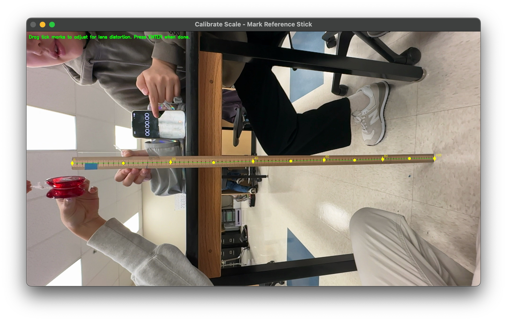

# VideoGrapher

> [!NOTE]
> This app so far is 99% written by AI. That being said, it works.

A Python application for tracking objects in videos with precise position measurements. Features interactive calibration for lens distortion correction, customizable reference points, and exportable position data.

## Citation

If you use this software in your research or project, please cite it as:

**BibTeX:**
```bibtex
@software{hu2025videographer,
  author = {Hu, Bryan},
  title = {VideoGrapher: Object Tracking with Lens Distortion Correction},
  year = {2025},
  url = {https://github.com/ThatXliner/videographer},
  version = {0.1.0}
}
```

**APA:**
```
Hu, B. (2025). VideoGrapher: Object Tracking with Lens Distortion Correction (Version 0.1.0) [Computer software]. https://github.com/ThatXliner/videographer
```

**MLA:**
```
Hu, Bryan. VideoGrapher: Object Tracking with Lens Distortion Correction. Version 0.1.0, 2025, https://github.com/ThatXliner/videographer.
```

See also: [CITATION.cff](CITATION.cff)

## Features

### 🎯 Object Tracking
- Interactive object selection via mouse-drawn bounding box
- Frame-by-frame tracking using OpenCV CSRT tracker
- 9 selectable reference points on the bounding box (corners, edges, center)
- Visual output video with tracking overlay

### 📏 Scale Calibration
- Interactive meter stick calibration with real-world measurements
- **Adjustable tick marks** for lens distortion correction
- Piecewise linear interpolation between tick marks for accurate measurements
- Visual tick mark display (every 10cm with labels)

### 📊 Data Export
- JSON export with comprehensive position data
- CSV converter with flexible options
- Both pixel and centimeter measurements
- Frame-by-frame timestamp tracking

## Installation

### Using `uv` (recommended)
```bash
uv sync
```

### Using `pip`
```bash
pip install opencv-contrib-python>=4.8.0 numpy>=1.24.0

# For timer OCR feature (optional)
pip install pytesseract>=0.3.10
```

**Note:** The timer OCR feature also requires Tesseract OCR to be installed on your system:
- **macOS**: `brew install tesseract`
- **Ubuntu/Debian**: `sudo apt-get install tesseract-ocr`
- **Windows**: Download installer from [Tesseract-OCR/Tesseract](https://github.com/tesseract-ocr/tesseract/wiki)

## Usage

### Basic Tracking

```bash
python main.py <input_video_path> [output_video_path] [options]
```

**Options:**
- `--stick-length LENGTH`: Length of reference stick in centimeters (default: 100.0)
- `--no-calibrate`: Skip calibration step (track in pixels only)
- `--use-timer`: Extract timestamps from on-screen timer using OCR
- `--debug-timer`: Debug mode for timer OCR (shows preprocessing steps, no tracking)

**Examples:**
```bash
# Basic usage with 1-meter stick
python main.py input.mp4 tracked_output.mp4

# Using a 30cm ruler
python main.py input.mp4 tracked_output.mp4 --stick-length 30

# Skip calibration (pixel tracking only)
python main.py input.mp4 tracked_output.mp4 --no-calibrate

# Use OCR to extract timestamps from on-screen timer
python main.py input.mp4 tracked_output.mp4 --use-timer

# Debug timer OCR (troubleshoot OCR issues)
python main.py input.mp4 --debug-timer
```

### Workflow

The application guides you through an interactive workflow:

#### **Step 1: Scale Calibration**

Mark the reference stick endpoints:
1. Click at one end of the reference stick (0cm mark)
2. Click at the other end (e.g., 100cm for a meter stick, 30cm for a ruler)
3. Press **ENTER** to continue

Adjust tick marks for lens distortion:
1. Tick marks appear at 10cm intervals along the reference stick
2. **Click and drag** any tick mark to adjust its position
3. Align ticks with the actual ruler markings in your video
4. Press **ENTER** when satisfied



> **Tip:** This step corrects for lens distortion. If your video has fisheye or other distortion, adjust the outer tick marks to match the curved ruler.

#### **Step 2: Timer Calibration** (if `--use-timer` is specified)

If you're using the `--use-timer` flag to extract timestamps from an on-screen timer:

1. Click and drag to draw a box around the timer display
2. **Adjust rotation** if needed (for rotated videos):
   - Press **'0'** for 0° (no rotation)
   - Press **'9'** for 90° clockwise
   - Press **'1'** for 180°
   - Press **'2'** for 270° (90° counter-clockwise)
3. Press **ENTER** to test OCR
   - Shows **raw OCR text** and **parsed timestamp**
   - If OCR fails, you'll be prompted to retry with options:
     - Press **'r'** to reset and adjust the region/rotation
     - Press **ENTER** again to continue anyway (not recommended)
     - Press **ESC** to skip timer tracking
4. Once OCR passes, timer calibration is complete

The timer region will be highlighted with a **cyan box** in the output video.

> **Note:** Rotation is useful for vertical videos that get rotated during processing. The timer image will be rotated before OCR to ensure digits are upright for proper reading.

**Supported Timer Formats:**
- `MM:SS.mmm` (e.g., `01:23.456`)
- `MM:SS` (e.g., `01:23`)
- `SS.mmm` (e.g., `83.456`)
- `SS` (e.g., `83`)

**Tips for Best OCR Results:**
- Ensure the timer has good contrast (dark text on light background or vice versa)
- Draw the box tightly around just the timer digits
- Use a high-quality video with readable digits
- **Set the correct rotation** for rotated videos (especially vertical videos)
- Check the **raw OCR text** output during calibration - it helps diagnose issues:
  - If raw text is gibberish → try different rotation
  - If raw text is close but parsing fails → timer format may not be supported
  - If raw text is empty → region may be too small or contrast too low

#### **Step 3: Select Object**

1. Click and drag to draw a bounding box around your object
2. Press **ENTER** to confirm
3. Press **'r'** to reset if needed

#### **Step 4: Choose Reference Point**

Select which point on the bounding box to track:

```
1: Top-Left      2: Top-Center      3: Top-Right
4: Center-Left   5: Center          6: Center-Right
7: Bottom-Left   8: Bottom-Center   9: Bottom-Right
```

- Press the number key (1-9) to select
- Default is **8 (Bottom-Center)**
- Press **ENTER** to confirm

#### **Step 5: Track Object**

The application processes the video automatically:
- Progress updates every 30 frames
- Creates output video with tracking overlay
- Generates `position_data.json`
- Extracts OCR timestamps (if timer enabled)
- **Auto-skips frames** before timer starts (when using `--use-timer`)

### Output Files

#### **Output Video**
- Bounding box (green rectangle)
- Reference point marker (red circle with white center)
- Timer region box (cyan rectangle, if timer enabled)
- Position overlay showing pixel and cm coordinates
- Frame counter

#### **position_data.json**

Comprehensive tracking data with metadata:

```json
{
  "metadata": {
    "video_path": "input.mp4",
    "total_frames": 300,
    "calibrated": true,
    "reference_point": "bottom-center",
    "calibration": {
      "reference_length_cm": 100.0,
      "tick_positions": [[x1, y1, 0], [x2, y2, 10], ...],
      "method": "piecewise linear interpolation with lens distortion correction"
    }
  },
  "tracking_data": [
    {
      "frame": 0,
      "timestamp": 0.0,
      "reference_point": "bottom-center",
      "position_x_pixels": 320,
      "position_y_pixels": 450,
      "position_x_cm": 42.5,
      "position_y_cm": 58.3,
      "bbox_pixels": {"x": 280, "y": 400, "w": 80, "h": 50},
      "bbox_cm": {"x": 37.2, "y": 51.8, "w": 10.6, "h": 6.5}
    },
    ...
  ]
}
```

**Data Fields:**
- `frame`: Frame number (0-indexed)
- `timestamp`: Time in seconds (from video FPS)
- `timestamp_ocr`: Time in seconds (from on-screen timer, if `--use-timer` enabled)
- `reference_point`: Which point was tracked
- `position_x/y_pixels`: Pixel coordinates of reference point
- `position_x/y_cm`: Real-world coordinates in centimeters
- `bbox_pixels/cm`: Bounding box in both units

**Note:** When using `--use-timer`, both `timestamp` (calculated from frame rate) and `timestamp_ocr` (extracted from on-screen timer) are included. The OCR timestamp may be more accurate if the video was recorded at variable frame rate or if frame timing is unreliable.

## CSV Export

Convert JSON data to CSV with flexible options:

```bash
python to_csv.py position_data.json [options]
```

### Options

| Option | Description | Default |
|--------|-------------|---------|
| `-r, --reference` | Reference point to extract | `position` |
| `-a, --axis` | Axis to extract (x or y) | `x` |
| `-o, --offset` | Offset to subtract (cm) | `0.0` |
| `--header` | Include CSV header | Off |
| `--delimiter` | CSV delimiter | `,` |

### Reference Point Options

- `position` - Use the tracked reference point (default)
- `bbox_top` - Top edge of bounding box
- `bbox_bottom` - Bottom edge of bounding box
- `bbox_left` - Left edge of bounding box
- `bbox_right` - Right edge of bounding box
- `bbox_center_x` - Horizontal center of bounding box
- `bbox_center_y` - Vertical center of bounding box

### Examples

**Basic usage:**
```bash
python to_csv.py position_data.json
```

**Extract bottom of bounding box with 1cm offset:**
```bash
python to_csv.py position_data.json -r bbox_bottom -a y -o 1.0
```

**With header, save to file:**
```bash
python to_csv.py position_data.json --header > output.csv
```

**Tab-delimited output:**
```bash
python to_csv.py position_data.json --delimiter $'\t' > output.tsv
```

**Get help:**
```bash
python to_csv.py --help
```

## Advanced Features

### Lens Distortion Correction

The adjustable tick marks allow you to correct for lens distortion:

1. After marking the meter stick endpoints, tick marks appear
2. Drag each tick to align with the actual ruler markings
3. The system uses **piecewise linear interpolation** between ticks
4. Each position is converted using the local scale at that point

This provides accurate measurements even with:
- Fisheye lenses
- Barrel/pincushion distortion
- Non-uniform scaling across the frame

### How Distortion Correction Works

The calibration system approximates lens distortion using **piecewise linear interpolation**:

1. Stores adjusted positions for all 11 tick marks (0-100cm)
2. For each tracked point, finds the closest ruler segment (between two ticks)
3. Projects the point onto that segment
4. Uses **linear interpolation** within that segment based on local tick positions
5. Calculates perpendicular distance using the local scale (cm/pixel ratio)

**What this means:** The ruler is divided into 10 segments (0-10cm, 10-20cm, etc.). Each segment can have its own scale, allowing the system to approximate curved distortion by chaining together straight segments. More tick marks = better approximation of smooth nonlinear distortion.

**Limitations:** This works well for moderate barrel/pincushion/fisheye distortion, but cannot capture rapid distortion changes within a 10cm segment. For extreme distortion, you'd need more tick marks or a parametric lens model.

### Customizable Reference Points

Choose the most appropriate tracking point for your analysis:
- **Bottom-center**: Good for tracking objects moving along a surface
- **Center**: Good for projectile motion or general tracking
- **Top/Bottom edges**: For measuring object heights
- **Left/Right edges**: For measuring widths or leading/trailing edges

### On-Screen Timer OCR

The `--use-timer` flag enables extraction of timestamps directly from an on-screen timer display using OCR technology. This is particularly useful for:

- **High-speed camera footage**: Where the video frame rate may not accurately represent real time
- **Variable frame rate videos**: Where frame-based timing is unreliable
- **Stopwatch recordings**: When you want to use the exact time shown in the video
- **Scientific experiments**: Where precise timing from equipment displays is critical

**How it works:**
1. During calibration, you select the timer region by drawing a box around it
2. Optionally set rotation (0°, 90°, 180°, 270°) for rotated videos
3. **OCR validation**: Test OCR on first frame, showing both raw text and parsed result
   - If parsing fails, you're prompted to retry with adjusted region/rotation
   - Prevents proceeding with misconfigured timer detection
4. Each frame, the timer region is extracted, rotated if needed, and converted to grayscale before OCR
5. Tesseract OCR extracts the digits
6. The timestamp is parsed and stored as `timestamp_ocr` in the JSON output

**Rotation Feature:**
- Essential for vertical videos that get rotated during processing
- The timer appears sideways/upside-down in the processed video
- Before OCR, the timer image is rotated back to upright position
- Ensures OCR can properly read the digits

**Auto-Skip Before Timer Starts:**
- When using `--use-timer`, the application automatically skips frames where the timer reads 0.000 (or fails OCR)
- Tracking begins only when the timer shows a non-zero value
- Useful for lab recordings where you set up the experiment before starting the timer
- Saves processing time and avoids tracking before the experiment begins
- Progress messages show how many frames were skipped

**Limitations:**
- OCR accuracy depends on video quality, contrast, and font clarity
- Very small or blurry timer displays may not be readable
- Some frames may fail OCR (resulting in missing `timestamp_ocr` values)
- Processing time is slightly increased due to OCR operations
- Auto-skip assumes timer starts at a value > 0 (e.g., 0.001 or higher)

### Timer OCR Debug Mode

If timer OCR isn't working properly, use **debug mode** to diagnose the issue:

```bash
python main.py input.mp4 --debug-timer
```

**Debug mode shows:**
1. Original timer region you selected
2. Image after rotation (if any)
3. Grayscale conversion
4. Raw OCR text and parsed result

**How to use:**
- Draw box around timer → Press SPACE to test OCR
- View 3 preprocessing windows showing each transformation step
- See exactly what Tesseract receives and what it reads
- Adjust region/rotation and test again with SPACE
- Press 'r' to reset, ESC to exit

Debug mode exits without running tracking, making it fast for iteration.

## Tips for Best Results

### Camera Setup
- Mount camera on stable tripod
- Keep meter stick parallel to the plane of motion
- Ensure good lighting and contrast
- Avoid motion blur (use faster shutter speed)

### Calibration
- Use a high-contrast meter stick that's clearly visible
- Place the meter stick in the same plane as object motion
- If using adjustable ticks, zoom in to align precisely
- Take time to adjust distorted tick marks carefully

### Object Selection
- Draw bounding box tightly around the object
- Include distinctive features for better tracking
- Choose a reference point that's consistently visible
- Test tracking on a few frames first

### Troubleshooting
- **Tracking lost**: Object may be too small or moving too fast
- **Inaccurate measurements**: Check tick mark alignment
- **Jittery tracking**: Try smaller bounding box or different tracker settings

## Technical Details

### Dependencies
- **opencv-contrib-python**: CSRT tracker and video I/O
<!--- **norfair**: Object tracking framework (currently used minimally)-->
- **numpy**: Numerical operations
- **pytesseract** (optional): OCR for timer extraction (requires system Tesseract OCR installation)

### Tracking Algorithm
- Uses OpenCV's CSRT (Channel and Spatial Reliability Tracking) tracker
- Initializes on user-selected bounding box
- Updates frame-by-frame with adaptive model
- Handles scale changes and partial occlusions

### Coordinate System
- Origin (0, 0) is at the **start point** of the meter stick
- X-axis runs along the meter stick direction
- Y-axis is perpendicular distance from the ruler
- All measurements in centimeters after calibration

## Project Structure

```
videographer/
├── main.py              # Main tracking application
├── to_csv.py           # CSV export tool
├── position_data.json  # Generated tracking data (gitignored)
├── output.mp4          # Generated output video (gitignored)
├── pyproject.toml      # Project dependencies
└── README.md           # This file
```

## Contributing

Suggestions and improvements welcome! Key areas for enhancement:
- Additional tracker algorithms
- Automatic object detection
- Multi-object tracking
- Real-time preview during tracking
- GUI application

## License

MIT License - feel free to use for research, education, or commercial projects.

## Acknowledgments

- OpenCV for computer vision tools
<!--- Norfair for tracking framework-->
- CSRT tracker algorithm by Lukežič et al.
